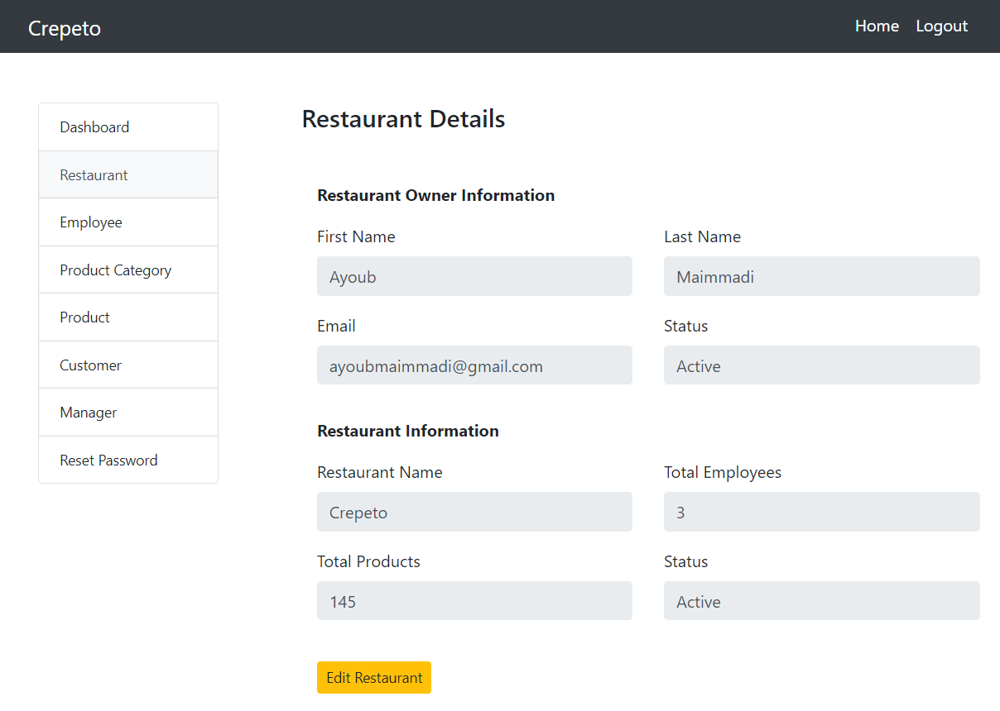

# Crepeto 

## Database Project UI concept using React and Bootstrap.

## Allows the manager the have full managerial control over his business

### The admin or manager can Add, Delete, manage, and Search ITems, Inventory, Employees, amd more.

To use/view this system you need to:

1- Clone or Download this repository

2- Have node.js pre-installed in you computer

3- Launch your IDE and cd into the projct

4- open terminal and run:

##### - `npm unstall` to install node modules

##### - `npm start` to open developement at localhost:3000

### You can view this website using the link https://crepeto-ui-concept.netlify.app

