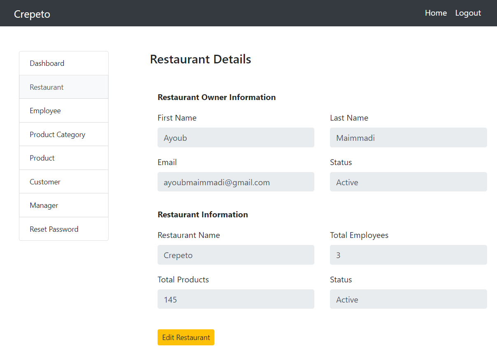

# Crepeto (Still In Production)

## Database Project using React: (JS/BOOTSTRAP/PSQL/...)

## Allows the manager the have full managerial control over his business

### He can Add, Delete, and Search ITems, Inventory, and Employees

To use/view this system you need to:

1- Clone or Download this repository

2- Have node.js pre-installed in you computer

3- Launch your IDE and cd into the projct

4- open terminal and run:

##### - `npm unstall` to install node modules

##### - `npm start` to open developement at localhost:3000

### You can view this website using the link https://crepeto.netlify.app/

### You can view this website' API using the link https://crepeto-api.herokuapp.com/

## Or Using Phone

